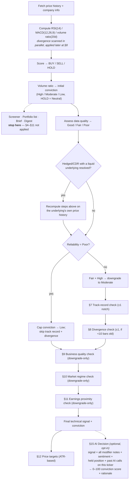

# Signal Decision Logic

A complete account of how Market Analyzer's BUY / SELL / HOLD call and its
conviction level get produced, and everything that is (and is not) allowed
to influence that call. Written for outside review of the methodology.
Source of truth: `main.py`.

There are two decision-making systems here, not one. The **mechanical
signal** (§1–§12) is deterministic, auditable, and runs — in some form — on
every ticker shown anywhere in the app. The **AI Decision** (§15) is a
separate, opt-in synthesis a user explicitly requests for one ticker at a
time; it reads the mechanical signal and everything that fed it, but has no
path back into it. Sections below are numbered in actual execution order.

## Pipeline overview

## How to read this

| | |
|---|---|
| **Full pipeline** (§1–§15) | `/api/analyze/{ticker}` — the single-ticker Analyze page, and a Portfolio holding's "AI Decision" button |
| **Base signal only** (§1–§2) | Screener, Morning Brief, Portfolio's holdings list, Digest — see §13 |

---

## §1 Core technical signal — *every surface*

A single, transparent scoring rule — no machine learning, no fitted weights.

- **RSI** — Wilder's RSI, 14-period (`gain`/`loss` EWM, `alpha=1/14`).
- **MACD** — EMA(12) − EMA(26); signal = EMA(9) of that; histogram = MACD − signal.
- **Volume ratio** — latest day's volume ÷ trailing 20-day average (needs 21 days of history, else `None`).

**Score rule:** `RSI < 30` → +1, `RSI > 70` → −1, else 0. `MACD histogram > 0`
→ +1, `< 0` → −1, else 0. `score ≥ 1` → **BUY**, `score ≤ −1` → **SELL**,
otherwise **HOLD**. Missing RSI/MACD (fewer than 14 warm-up bars) forces
HOLD at Low conviction rather than a guess.

Volume never changes direction — only how much weight to put behind the call
(§2). RSI is mean-reversion logic, MACD is trend-following logic, and the
two can and do disagree; when they cancel to a net score of 0, the result is
HOLD, not an average (see §16).

## §2 Initial conviction (volume) — *every surface*

| Condition | Conviction |
|---|---|
| Signal is HOLD | **Neutral** — fixed, off the adjustable ladder |
| Volume ratio unavailable | Moderate |
| ratio ≥ 1.5 | High |
| 1.0 ≤ ratio < 1.5 | Moderate |
| ratio < 1.0 | Low |

Conviction lives on a three-rung ladder — **Low → Moderate → High** — and
every modifier from here on (§7–§11) only ever moves it one rung at a time,
in either direction. HOLD's "Neutral" sits off that ladder entirely: a
modifier that would nudge a HOLD is always a no-op, by design.

## §3 Divergence detection — *Analyze endpoint only*

Price and momentum disagreeing, detected here but not yet acted on — §8
decides whether it moves conviction.

- **Pivots** — local price highs/lows over a centered `2k+1` window, `k = 3` bars.
- **Pairing** — consecutive pivots of the same type, 8–120 bars apart.
- **Bullish** — price makes a lower low *and* RSI makes a higher low.
- **Bearish** — price makes a higher high *and* RSI makes a lower high.
- **Lag** — flagged `k` bars after the second pivot, so the detector never uses future information.

Only the most recent hit within the last 30 bars is kept and reported.

## §4 Data reliability scoring — *Analyze endpoint only*

RSI/MACD assume a liquid, continuously-priced market. This scores how much
that assumption actually holds.

| Condition | Points |
|---|---|
| 60-day average volume unavailable | +2 |
| avg. volume < 50,000/day | +3 |
| 50,000 ≤ avg. volume < 250,000/day | +2 |
| 250,000 ≤ avg. volume < 1,000,000/day | +1 |
| Looks like an ETF, mutual fund, or hedged/CDR wrapper | +2 |
| Price unchanged on ≥5 of the last 20 sessions | +2 |

**Reliability:** `score ≤ 1` → Good · `score ≤ 3` → Fair · `score > 3` → Poor.

## §5 Hedged / CDR substitution — *Analyze endpoint only*

A CAD-hedged CDR trades a fraction of its underlying's volume, so its own
RSI/MACD mostly measure the wrapper's thin trading. When the name matches a
hedge/CDR pattern, the app searches for the real underlying and — *only if*
a candidate trades at least `max(5 × this ticker's average volume, 200,000)`
shares/day — recomputes §1–§4 entirely on that underlying's price history
instead. No qualifying candidate → falls through to §6 and the original
ticker's own (penalized) signal stands. Fails closed, never silently
substitutes the wrong company.

## §6 Reliability gate — *Analyze endpoint only*

| Reliability | Effect |
|---|---|
| **Poor** | Conviction hard-capped to Low. §7 and §8 are both **skipped**. |
| **Fair** + High conviction | Downgraded to Moderate before §7 runs. |
| **Good** | No adjustment; proceeds straight to §7. |

## §7 Modifier — track record — *Analyze endpoint only, cache-only*

The one modifier that isn't a heuristic: this ticker's own measured history
with this exact signal, reusing the app's on-demand backtest methodology
directly.

- **Source** — a cached 2-year, event-anchored backtest (10-day holding
  horizon, net of trading costs), refreshed at most every 24h. Never
  computed inline — if nothing is cached yet, this step is a silent no-op.
- **Minimum sample** — 8 past signal events of the same side on this ticker.
- **Strong edge** — ±1.0 percentage point vs. a random-day baseline.

**Rule:** edge ≥ +1.0pp → conviction +1. Edge ≤ −1.0pp → conviction −1.
Otherwise, or too few events → no change (reasoning still records why).

## §8 Modifier — divergence — *Analyze endpoint only*

Applies the divergence found in §3 — only if recent: `bars_ago` must be
0–9, the identical 10-bar window the app's own `divergence_confirm`
backtest variant tests against.

| Signal | Divergence | Effect |
|---|---|---|
| BUY | bullish (agrees) | +1 |
| BUY | bearish (contradicts) | −1 |
| SELL | bearish (agrees) | +1 |
| SELL | bullish (contradicts) | −1 |

## §9 Modifier — business quality — *Analyze endpoint only, downgrade-only*

A fundamentals grade — profit margin, debt/equity, ROE, revenue growth,
current ratio — bucketed and summed to a 0–100% score, graded Strong (≥75%)
/ Decent (≥50%) / Weak (≥25%) / Poor. Grades the business, not the stock
price.

Only two combinations trigger a downgrade: **BUY on a Poor-graded
business**, or **SELL on a Strong one** → conviction −1. A Strong-quality
BUY gets no bonus. HOLD and "Unknown" (no fundamentals — common for ETFs)
are exempt.

## §10 Modifier — market regime — *Analyze endpoint only, downgrade-only*

S&P 500 (or S&P/TSX for Canadian tickers), refreshed hourly and shared
across requests in that window.

- **Trend** — index vs. its 200-day SMA; beyond ±3% counts as trending.
- **Volatility** — current 20-day realized volatility's percentile rank
  against its own trailing 2-year history; ≥70th percentile counts as elevated.

**Rule:** a counter-trend call (BUY while the index is >3% below its
200-day average, or SELL while >3% above) *or* elevated volatility →
conviction −1. The two conditions combine into a single nudge, not stacked.

## §11 Modifier — earnings proximity — *Analyze endpoint only, downgrade-only*

A report due in the next **0–7 days** → conviction −1. A guardrail, not a
directional prediction — fires regardless of signal direction, even on a
HOLD (whose Neutral conviction has nothing to move, but the note still shows).

## §12 Price targets — *Analyze endpoint only*

- **Support** — 20-day low. **Resistance** — 20-day high.
- **ATR** — 14-period Wilder-smoothed Average True Range.

**On BUY:** entry = current price; stop-loss = entry − 1.5×ATR; take-profit
= entry + 3×ATR (≈2:1 reward-to-risk). **On SELL/HOLD:** no new entry —
support/resistance shown as levels to watch instead.

## §13 Where the full pipeline runs

The five conviction modifiers (§7–§11), the reliability gate (§6), and
price targets (§12) run **only** on `/api/analyze/{ticker}`.

| Surface | What it shows |
|---|---|
| Analyze (single ticker) | Full pipeline — §1–§12, plus §15 on request. |
| Screener, Morning Brief, Portfolio's holdings list, Digest | §1–§2 only: raw signal + volume-based conviction. No reliability gate, no track record/divergence/quality/regime/earnings modifiers, no price targets. |
| Portfolio → a single holding's "AI Decision" | Drills into the full pipeline for that one ticker, same as Analyze. |

The reason is cost, not disagreement about correctness: scoring dozens of
screener tickers in one batched request has to stay light, while
quality/regime/earnings checks each cost an extra per-ticker lookup. A
signal shown in a list view is a strictly narrower read than the same
ticker opened individually.

## §14 News sentiment — *Analyze endpoint only, informational*

Up to 5 recent headlines scored with a FinBERT sentiment model
(positive/negative/neutral, each with a confidence). A directional average
maps to a 0–1 `bullish_score`: >0.6 supportive, <0.4 pressuring, otherwise
neutral. Displayed and passed to the AI Decision (§15) as context — **it
never adjusts `technical.conviction`**, unlike §7–§11.

## §15 The AI Decision layer — *opt-in, one ticker at a time*

A separate call to Claude (model: `claude-sonnet-5`), triggered explicitly
from the UI, reasoning across everything already computed. It never changes
the mechanical signal — it produces its own, independent artifact.

**Inputs:** final signal + reasoning + divergence flag; §7's track-record
output; §4's reliability verdict; fundamentals, quality, regime, earnings in
full; §12's price targets as a baseline to adjust from; §14's sentiment
including headlines; held position (shares/cost basis/unrealized P&L) if
applicable; up to 5 of this model's own past calls on this exact ticker,
already resolved against a later price.

**Output:** `conviction_score` (0–100, required — the prompt discourages
defaulting to 50 out of caution), `conviction_label` (2–4 words),
`entry`/`stop_loss`/`take_profit` (may adjust the §12 baseline only with a
stated reason; must be `null` if the baseline is `null` or a position is
already held), `risk_reward_ratio` (recomputed, not copied), and a
one-sentence `rationale`.

**Double-counting guard:** because §7–§11 already fold track record,
quality, regime, divergence, and earnings into `conviction` before this
layer sees it, the system prompt explicitly tells the model those factors
are not fresh evidence — only a severity or combination the mechanical
one-notch nudge couldn't express should move its score further on the same
grounds.

Requires `ANTHROPIC_API_KEY`; silently unavailable otherwise, rest of the
app unaffected. Cached per exact question asked (ticker + held-position
state + history) for 10 minutes.

## §16 Notes for review

Specific interactions worth an outside eye, rather than gaps — each is a
deliberate trade-off, flagged here so the trade-off itself can be evaluated.

**Substituted signals still read the original ticker's fundamentals,
earnings, and price data.** When §5 substitutes a liquid underlying's
RSI/MACD for a thin CDR's own, that substitution is scoped narrowly: §9's
quality grade, §11's earnings date, and §12's ATR/support/resistance are all
still computed from the *original* ticker's `info` and price history, not
the underlying's. In practice this is usually immaterial (a CDR and its
underlying share the same business and a very similar earnings calendar),
but it means the entry price and stop/target sizing reflect the CDR's own —
thinner, noisier — volatility, even while the BUY/SELL call itself came from
the underlying's cleaner data.

**RSI and MACD can cancel exactly when it matters most.** RSI is
mean-reversion logic; MACD is trend-following logic. A sharp reversal can
push RSI overbought/oversold in the same move that flips MACD's histogram
sign, netting the score to 0 → HOLD, in precisely the volatile moment a
directional call would be most consequential. This is inherent to combining
the two philosophies additively rather than resolving the conflict.

**The core scoring formula is unvalidated by design, not oversight.** The
app carries a separate, statistically rigorous backtest harness (binomial
test, Bonferroni-corrected across a diversified basket) that compares the
base RSI+MACD rule against eight candidate filters — trend, volume, weekly
agreement, relative strength, divergence confirmation among them. As of this
writing, none of those filters has demonstrated a reliable edge over the
base rule at that correction threshold. The formula in §1 has therefore
been left unchanged rather than revised on intuition alone; that same
harness is the right tool to re-run before any future change to it.

**The batch path (§13) has no reliability floor.** Because
Screener/Portfolio-list/Brief/Digest skip §4–§6 entirely, a thinly-traded or
derivative ticker can show a "High" conviction signal in a list view built
only from a noisy volume ratio — a read that the same ticker, opened
individually, would likely have capped to Low. This is a real, current gap
between the two paths, not a hidden one.

---

*Does not cover portfolio-level analytics (concentration risk, realized
P/L) or the CSV import/backtest tooling, which sit outside this decision
path. A rendered, presentation-friendly version of this document is also
available as a shared artifact.*
